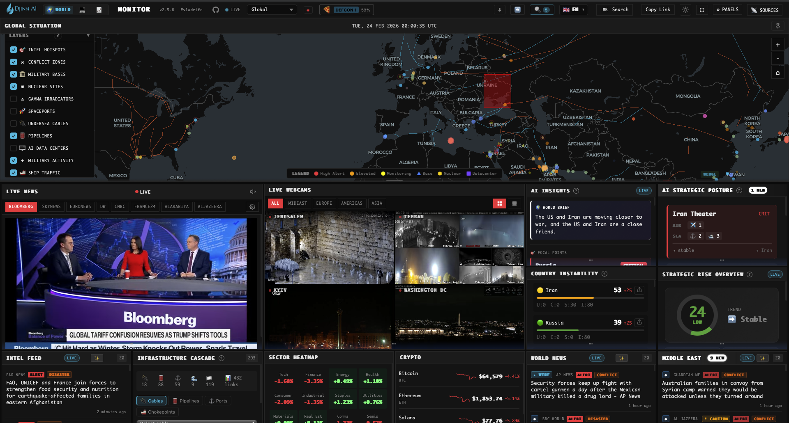

# World Monitor

**Real-time global intelligence dashboard** — AI-powered news aggregation, geopolitical monitoring, and infrastructure tracking in a unified situational awareness interface.

[](https://github.com/koala73/worldmonitor/stargazers)
[](https://github.com/koala73/worldmonitor/network/members)
[](https://www.gnu.org/licenses/agpl-3.0)
[](https://www.typescriptlang.org/)
[](https://github.com/koala73/worldmonitor/commits/main)
[](https://github.com/koala73/worldmonitor/releases/latest)

<p align="center">
  <a href="https://worldmonitor.io"></a>&nbsp;
  <a href="https://tech.worldmonitor.io"></a>&nbsp;
  <a href="https://finance.worldmonitor.io"></a>
</p>

<p align="center">
  <a href="https://worldmonitor.io/api/download?platform=windows-exe"></a>&nbsp;
  <a href="https://worldmonitor.io/api/download?platform=macos-arm64"></a>&nbsp;
  <a href="https://worldmonitor.io/api/download?platform=macos-x64"></a>&nbsp;
  <a href="https://worldmonitor.io/api/download?platform=linux-appimage"></a>
</p>

<p align="center">
  <a href="./docs/DOCUMENTATION.md"><strong>Full Documentation</strong></a> &nbsp;·&nbsp;
  <a href="https://github.com/koala73/worldmonitor/releases/latest"><strong>All Releases</strong></a>
</p>



---

## Why World Monitor?

| Problem                            | Solution                                                                                                   |
| ---------------------------------- | ---------------------------------------------------------------------------------------------------------- |
| News scattered across 100+ sources | **Single unified dashboard** with 100+ curated feeds                                                       |
| No geospatial context for events   | **Interactive map** with 35+ toggleable data layers                                                        |
| Information overload               | **AI-synthesized briefs** with focal point detection and local LLM support                                 |
| Crypto/macro signal noise          | **7-signal market radar** with composite BUY/CASH verdict                                                  |
| Expensive OSINT tools ($$$)        | **100% free & open source**                                                                                |
| Static news feeds                  | **Real-time updates** with live video streams                                                              |
| Cloud-dependent AI tools           | **Run AI locally** with Ollama/LM Studio — no API keys, no data leaves your machine                       |
| Web-only dashboards                | **Native desktop app** (Tauri) for macOS, Windows, and Linux + installable PWA with offline map support    |
| Flat 2D maps                       | **3D WebGL globe** with deck.gl rendering and 35+ toggleable data layers                                   |
| Siloed financial data              | **Finance variant** with 92 stock exchanges, 19 financial centers, 13 central banks, and Gulf FDI tracking |
| Undocumented, fragile APIs         | **Proto-first API contracts** — 17 typed services with auto-generated clients, servers, and OpenAPI docs   |

---

## Live Demos

| Variant             | URL                                                          | Focus                                            |
| ------------------- | ------------------------------------------------------------ | ------------------------------------------------ |
| **World Monitor**   | [worldmonitor.io](https://worldmonitor.io)                 | Geopolitics, military, conflicts, infrastructure |
| **Tech Monitor**    | [tech.worldmonitor.io](https://tech.worldmonitor.io)       | Startups, AI/ML, cloud, cybersecurity            |
| **Finance Monitor** | [finance.worldmonitor.io](https://finance.worldmonitor.io) | Global markets, trading, central banks, Gulf FDI |

All three variants run from a single codebase — switch between them with one click via the header bar (🌍 WORLD | 💻 TECH | 📈 FINANCE).

---

## Key Features

### Localization & Regional Support

- **Multilingual UI** — Fully localized interface supporting **14 languages: English, French, Spanish, German, Italian, Polish, Portuguese, Dutch, Swedish, Russian, Arabic, Chinese, Japanese, and Turkish**. Language bundles are lazy-loaded on demand — only the active language is fetched, keeping initial bundle size minimal.
- **RTL Support** — Native right-to-left layout support for Arabic (`ar`) and Hebrew.
- **Localized News Feeds** — Region-specific RSS selection based on language preference (e.g., viewing the app in French loads Le Monde, Jeune Afrique, and France24).
- **AI Translation** — Integrated LLM translation for news headlines and summaries, enabling cross-language intelligence gathering.
- **Regional Intelligence** — Dedicated monitoring panels for Africa, Latin America, Middle East, and Asia with local sources.

### Interactive 3D Globe

- **WebGL-accelerated rendering** — deck.gl + MapLibre GL JS for smooth 60fps performance with thousands of concurrent markers. Switchable between **3D globe** (with pitch/rotation) and **flat map** mode via `VITE_MAP_INTERACTION_MODE`
- **35+ data layers** — conflicts, military bases, nuclear facilities, undersea cables, pipelines, satellite fire detection, protests, natural disasters, datacenters, displacement flows, climate anomalies, cyber threat IOCs, stock exchanges, financial centers, central banks, commodity hubs, Gulf investments, and more
- **Smart clustering** — Supercluster groups markers at low zoom, expands on zoom in. Cluster thresholds adapt to zoom level
- **Progressive disclosure** — detail layers (bases, nuclear, datacenters) appear only when zoomed in; zoom-adaptive opacity fades markers from 0.2 at world view to 1.0 at street level
- **Label deconfliction** — overlapping labels (e.g., multiple BREAKING badges) are automatically suppressed by priority, highest-severity first
- **8 regional presets** — Global, Americas, Europe, MENA, Asia, Africa, Oceania, Latin America
- **Time filtering** — 1h, 6h, 24h, 48h, 7d event windows
- **URL state sharing** — map center, zoom, active layers, and time range are encoded in the URL for shareable views (`?view=mena&zoom=4&layers=conflicts,bases`)

### AI-Powered Intelligence

- **World Brief** — LLM-synthesized summary of top global developments with a 4-tier provider fallback chain: Ollama (local) → Groq (cloud) → OpenRouter (cloud) → browser-side T5 (Transformers.js). Each tier is attempted with a 5-second timeout before falling through to the next, so the UI is never blocked. Results are Redis-cached (24h TTL) and content-deduplicated so identical headlines across concurrent users trigger exactly one LLM call
- **Local LLM Support** — Ollama and LM Studio (any OpenAI-compatible endpoint) run AI summarization entirely on local hardware. No API keys required, no data leaves the machine. The desktop app auto-discovers available models from the local instance and populates a selection dropdown, filtering out embedding-only models. Default fallback model: `llama3.1:8b`
- **Hybrid Threat Classification** — instant keyword classifier with async LLM override for higher-confidence results
- **Focal Point Detection** — correlates entities across news, military activity, protests, outages, and markets to identify convergence
- **Country Instability Index** — real-time stability scores for 22 monitored nations using weighted multi-signal blend
- **Trending Keyword Spike Detection** — 2-hour rolling window vs 7-day baseline flags surging terms across RSS feeds, with CVE/APT entity extraction and auto-summarization
- **Strategic Posture Assessment** — composite risk score combining all intelligence modules with trend detection
- **Country Brief Pages** — click any country for a full-page intelligence dossier with CII score ring, AI-generated analysis, top news with citation anchoring, prediction markets, 7-day event timeline, active signal chips, infrastructure exposure, and stock market index — exportable as JSON, CSV, or image

### Real-Time Data Layers

<details>
<summary><strong>Geopolitical</strong></summary>

- Active conflict zones with escalation tracking (UCDP + ACLED)
- Intelligence hotspots with news correlation
- Social unrest events (dual-source: ACLED protests + GDELT geo-events, Haversine-deduplicated)
- Natural disasters from 3 sources (USGS earthquakes M4.5+, GDACS alerts, NASA EONET events)
- Sanctions regimes
- Cyber threat IOCs (C2 servers, malware hosts, phishing, malicious URLs) geo-located on the globe
- Weather alerts and severe conditions

</details>

<details>
<summary><strong>Military & Strategic</strong></summary>

- 220+ military bases from 9 operators
- Live military flight tracking (ADS-B)
- Naval vessel monitoring (AIS)
- Nuclear facilities & gamma irradiators
- APT cyber threat actor attribution
- Spaceports & launch facilities

</details>

<details>
<summary><strong>Infrastructure</strong></summary>

- Undersea cables with landing points, cable health advisories (NGA navigational warnings), and cable repair ship tracking
- Oil & gas pipelines
- AI datacenters (111 major clusters)
- 83 strategic ports across 6 types (container, oil, LNG, naval, mixed, bulk) with throughput rankings
- Internet outages (Cloudflare Radar)
- Critical mineral deposits
- NASA FIRMS satellite fire detection (VIIRS thermal hotspots)

</details>

<details>
<summary><strong>Market & Crypto Intelligence</strong></summary>

- 7-signal macro radar with composite BUY/CASH verdict
- BTC spot ETF flow tracker (IBIT, FBTC, GBTC, and 7 more)
- Stablecoin peg health monitor (USDT, USDC, DAI, FDUSD, USDe)
- Fear & Greed Index with 30-day history
- Bitcoin technical trend (SMA50, SMA200, VWAP, Mayer Multiple)
- JPY liquidity signal, QQQ/XLP macro regime, BTC hash rate
- Inline SVG sparklines and donut gauges for visual trends

</details>

<details>
<summary><strong>Tech Ecosystem</strong> (Tech variant)</summary>

- Tech company HQs (Big Tech, unicorns, public)
- Startup hubs with funding data
- Cloud regions (AWS, Azure, GCP)
- Accelerators (YC, Techstars, 500)
- Upcoming tech conferences

</details>

<details>
<summary><strong>Finance & Markets</strong> (Finance variant)</summary>

- 92 global stock exchanges — mega (NYSE, NASDAQ, Shanghai, Euronext, Tokyo), major (Hong Kong, London, NSE/BSE, Toronto, Korea, Saudi Tadawul), and emerging markets — with market caps and trading hours
- 19 financial centers — ranked by Global Financial Centres Index (New York #1 through offshore centers: Cayman Islands, Luxembourg, Bermuda, Channel Islands)
- 13 central banks — Federal Reserve, ECB, BoJ, BoE, PBoC, SNB, RBA, BoC, RBI, BoK, BCB, SAMA, plus supranational institutions (BIS, IMF)
- 10 commodity hubs — exchanges (CME Group, ICE, LME, SHFE, DCE, TOCOM, DGCX, MCX) and physical hubs (Rotterdam, Houston)
- Gulf FDI investment layer — 64 Saudi/UAE foreign direct investments plotted globally, color-coded by status (operational, under-construction, announced), sized by investment amount

</details>

### Live News & Video

- **150+ RSS feeds** across geopolitics, defense, energy, tech, and finance — domain-allowlisted proxy prevents CORS issues. Each variant loads its own curated feed set: ~25 categories for geopolitical, ~20 for tech, ~18 for finance
- **8 live video streams** — Bloomberg, Sky News, Al Jazeera, Euronews, DW, France24, CNBC, Al Arabiya — with automatic live detection that scrapes YouTube channel pages every 5 minutes to find active streams
- **Desktop embed bridge** — YouTube's IFrame API restricts playback in native webviews (error 153). The dashboard detects this and transparently routes through a cloud-hosted embed proxy with bidirectional message passing (play/pause/mute/unmute/loadVideo)
- **Idle-aware playback** — video players pause and are removed from the DOM after 5 minutes of inactivity, resuming when the user returns. Tab visibility changes also suspend/resume streams
- **19 live webcams** — real-time YouTube streams from geopolitical hotspots across 4 regions (Middle East, Europe, Americas, Asia-Pacific). Grid view shows 4 strategic feeds simultaneously; single-feed view available. Region filtering (ALL/MIDEAST/EUROPE/AMERICAS/ASIA), idle-aware playback that pauses after 5 minutes, and Intersection Observer-based lazy loading
- **Custom keyword monitors** — user-defined keyword alerts with word-boundary matching (prevents "ai" from matching "train"), automatic color-coding from a 10-color palette, and multi-keyword support (comma-separated). Monitors search across both headline titles and descriptions and show real-time match counts
- **Entity extraction** — Auto-links countries, leaders, organizations
- **Virtual scrolling** — news panels with 15+ items use a custom virtual list renderer that only creates DOM elements for visible items plus a 3-item overscan buffer. Viewport spacers simulate full-list height. Uses `requestAnimationFrame`-batched scroll handling and `ResizeObserver` for responsive adaptation. DOM elements are pooled and recycled rather than created/destroyed

### Signal Aggregation & Anomaly Detection

- **Multi-source signal fusion** — internet outages, military flights, naval vessels, protests, AIS disruptions, satellite fires, and keyword spikes are aggregated into a unified intelligence picture with per-country and per-region clustering
- **Temporal baseline anomaly detection** — Welford's online algorithm computes streaming mean/variance per event type, region, weekday, and month over a 90-day window. Z-score thresholds (1.5/2.0/3.0) flag deviations like "Military flights 3.2x normal for Thursday (January)" — stored in Redis via Upstash
- **Regional convergence scoring** — when multiple signal types spike in the same geographic area, the system identifies convergence zones and escalates severity

### Story Sharing & Social Export

- **Shareable intelligence stories** — generate country-level intelligence briefs with CII scores, threat counts, theater posture, and related prediction markets
- **Multi-platform export** — custom-formatted sharing for Twitter/X, LinkedIn, WhatsApp, Telegram, Reddit, and Facebook with platform-appropriate formatting
- **Deep links** — every story generates a unique URL (`/story?c=<country>&t=<type>`) with dynamic Open Graph meta tags for rich social previews
- **Canvas-based image generation** — stories render as PNG images for visual sharing, with QR codes linking back to the live dashboard
- **Dynamic Open Graph images** — the `/api/og-story` endpoint generates 1200×630px SVG cards on-the-fly for each country story. Cards display the country name, CII score gauge arc with threat-level coloring, a 0–100 score bar, and signal indicator chips (threats, military, markets, convergence). Social crawlers (Twitter, Facebook, LinkedIn, Telegram, Discord, Reddit, WhatsApp) receive these cards via `og:image` meta tags, while regular browsers get a 302 redirect to the SPA. Bot detection uses a user-agent regex for 10+ known social crawler signatures

### Desktop Application (Tauri)

- **Native desktop app** for macOS, Windows, and Linux — packages the full dashboard with a local Node.js sidecar that runs all 60+ API handlers locally
- **OS keychain integration** — API keys stored in the system credential manager (macOS Keychain, Windows Credential Manager), never in plaintext files
- **Token-authenticated sidecar** — a unique session token prevents other local processes from accessing the sidecar on localhost. Generated per launch using randomized hashing
- **Cloud fallback** — when a local API handler fails or is missing, requests transparently fall through to the cloud deployment (worldmonitor.io) with origin headers stripped
- **Settings window** — dedicated configuration UI (Cmd+,) with three tabs: **LLMs** (Ollama endpoint, model selection, Groq, OpenRouter), **API Keys** (12+ data source credentials with per-key validation), and **Debug & Logs** (traffic log, verbose mode, log files). Each tab runs an independent verification pipeline — saving in the LLMs tab doesn't block API Keys validation
- **Automatic model discovery** — when you set an Ollama or LM Studio endpoint URL in the LLMs tab, the settings panel immediately queries it for available models (tries Ollama native `/api/tags` first, then OpenAI-compatible `/v1/models`) and populates a dropdown. Embedding models are filtered out. If discovery fails, a manual text input appears as fallback
- **Cross-window secret sync** — the main dashboard and settings window run in separate webviews with independent JS contexts. Saving a secret in Settings writes to the OS keychain and broadcasts a `localStorage` change event. The main window listens for this event and hot-reloads all secrets without requiring an app restart
- **Consolidated keychain vault** — all secrets are stored as a single JSON blob in one keychain entry (`secrets-vault`) rather than individual entries per key. This reduces macOS Keychain authorization prompts from 20+ to exactly 1 on each app launch. A one-time migration reads any existing individual entries, consolidates them, and cleans up the old format
- **Verbose debug mode** — toggle traffic logging with persistent state across restarts. View the last 200 requests with timing, status codes, and error details
- **DevTools toggle** — Cmd+Alt+I opens the embedded web inspector for debugging
- **Auto-update checker** — polls the cloud API for new versions every 6 hours. Displays a non-intrusive update badge with direct download link and per-version dismiss. Variant-aware — a Tech Monitor desktop app links to the correct Tech Monitor release asset

### Progressive Web App

- **Installable** — the dashboard can be installed to the home screen on mobile or as a standalone desktop app via Chrome's install prompt. Full-screen `standalone` display mode with custom theme color
- **Offline map support** — MapTiler tiles are cached using a CacheFirst strategy (up to 500 tiles, 30-day TTL), enabling map browsing without a network connection
- **Smart caching strategies** — APIs and RSS feeds use NetworkOnly (real-time data must always be fresh), while fonts (1-year TTL), images (7-day StaleWhileRevalidate), and static assets (1-year immutable) are aggressively cached
- **Auto-updating service worker** — checks for new versions every 60 minutes. Tauri desktop builds skip service worker registration entirely (uses native APIs instead)
- **Offline fallback** — a branded fallback page with retry button is served when the network is unavailable

### Additional Capabilities

- Signal intelligence with "Why It Matters" context
- Infrastructure cascade analysis with proximity correlation
- Maritime & aviation tracking with surge detection
- Prediction market integration (Polymarket) with 3-tier JA3 bypass (browser-direct → Tauri native TLS → cloud proxy)
- Service status monitoring (cloud providers, AI services)
- Shareable map state via URL parameters (view, zoom, coordinates, time range, active layers)
- Data freshness monitoring across 14 data sources with explicit intelligence gap reporting
- Per-feed circuit breakers with 5-minute cooldowns to prevent cascading failures
- Browser-side ML worker (Transformers.js) for NER and sentiment analysis without server dependency
- **Cmd+K search** — fuzzy search across 20+ result types: news headlines, countries (with direct country brief navigation), hotspots, markets, military bases, cables, pipelines, datacenters, nuclear facilities, tech companies, and more
- **Historical playback** — dashboard snapshots are stored in IndexedDB. A time slider allows rewinding to any saved state, with live updates paused during playback
- **Mobile detection** — screens below 768px receive a warning modal since the dashboard is designed for multi-panel desktop use
- **UCDP conflict classification** — countries with active wars (1,000+ battle deaths/year) receive automatic CII floor scores, preventing optimistic drift
- **HAPI humanitarian data** — UN OCHA humanitarian access metrics and displacement flows feed into country-level instability scoring with dual-perspective (origins vs. hosts) panel
- **Idle-aware resource management** — animations pause after 2 minutes of inactivity and when the tab is hidden, preventing battery drain. Video streams are destroyed from the DOM and recreated on return
- **Country-specific stock indices** — country briefs display the primary stock market index with 1-week change (S&P 500 for US, Shanghai Composite for China, etc.) via the `/api/stock-index` endpoint
- **Climate anomaly panel** — 15 conflict-prone zones monitored for temperature/precipitation deviations against 30-day ERA5 baselines, with severity classification feeding into CII
- **Country brief export** — every brief is downloadable as structured JSON, flattened CSV, or rendered PNG image, enabling offline analysis and reporting workflows
- **Print/PDF support** — country briefs include a print button that triggers the browser's native print dialog, producing clean PDF output
- **Oil & energy analytics** — WTI/Brent crude prices, US production (Mbbl/d), and inventory levels via the EIA API with weekly trend detection
- **Population exposure estimation** — WorldPop density data estimates civilian population within event-specific radii (50–100km) for conflicts, earthquakes, floods, and wildfires
- **Trending keywords panel** — real-time display of surging terms across all RSS feeds with spike severity, source count, and AI-generated context summaries
- **Download banner** — persistent notification for web users linking to native desktop installers for their detected platform
- **Download API** — `/api/download?platform={windows-exe|windows-msi|macos-arm64|macos-x64|linux-appimage}[&variant={full|tech|finance}]` redirects to the matching GitHub Release asset, with fallback to the releases page
- **Non-tier country support** — clicking countries outside the 22 tier-1 list opens a brief with available data (news, markets, infrastructure) and a "Limited coverage" badge; country names for non-tier countries resolve via `Intl.DisplayNames`
- **Feature toggles** — 15 runtime toggles (AI/Ollama, AI/Groq, AI/OpenRouter, FRED economic, EIA energy, internet outages, ACLED conflicts, threat intel feeds, AIS relay, OpenSky, Finnhub, NASA FIRMS) stored in `localStorage`, allowing administrators to enable/disable data sources without rebuilding
- **AIS chokepoint detection** — the relay server monitors 8 strategic maritime chokepoints (Strait of Hormuz, Suez Canal, Malacca Strait, Bab el-Mandeb, Panama Canal, Taiwan Strait, South China Sea, Turkish Straits) and classifies transiting vessels by naval candidacy using MMSI prefixes, ship type codes, and name patterns
- **AIS density grid** — vessel positions are aggregated into 2°×2° geographic cells over 30-minute windows, producing a heatmap of maritime traffic density that feeds into convergence detection
- **Panel resizing** — drag handles on panel edges allow height adjustment (span-1 through span-4 grid rows), persisted to localStorage. Double-click resets to default height
- **Ultra-wide monitor layout** — on screens 2000px+ wide, the layout automatically switches from vertical stacking to an L-shaped arrangement: the map floats left at 60% width while panels tile to the right and below it, maximizing screen real estate on ultra-wide and 4K monitors. Uses CSS `display: contents` and float-based wrapping — no JavaScript layout engine required
- **Dark/light theme** — persistent theme toggle with 20+ semantic color variable overrides. Dark theme is the default. Theme preference is stored in localStorage, applied before first paint (no flash of wrong theme), and syncs the `<meta name="theme-color">` for native browser chrome. A `theme-changed` custom event allows panels to react to switches
- **Panel drag-and-drop reordering** — panels can be reordered via drag-and-drop within the grid. The custom order is persisted to localStorage and restored on reload. Touch events are supported for tablet use
- **Map pin mode** — a 📌 button pins the map in a fixed position so it remains visible while scrolling through panels. Pin state is persisted to localStorage

---

## Regression Testing

Map overlay behavior is validated in Playwright using the map harness (`/tests/map-harness.html`).

- Cluster-state cache initialization guard:
  - `updates protest marker click payload after data refresh`
  - `initializes cluster movement cache on first protest cluster render`
- Run by variant:
  - `npm run test:e2e:full -- -g "updates protest marker click payload after data refresh|initializes cluster movement cache on first protest cluster render"`
  - `npm run test:e2e:tech -- -g "updates protest marker click payload after data refresh|initializes cluster movement cache on first protest cluster render"`

---

## How It Works

### Country Brief Pages

Clicking any country on the map opens a full-page intelligence dossier — a single-screen synthesis of all intelligence modules for that country. The brief is organized into a two-column layout:

**Left column**:

- **Instability Index** — animated SVG score ring (0–100) with four component breakdown bars (Unrest, Conflict, Security, Information), severity badge, and trend indicator
- **Intelligence Brief** — AI-generated analysis (Ollama local / Groq / OpenRouter, depending on configured provider) with inline citation anchors `[1]`–`[8]` that scroll to the corresponding news source when clicked
- **Top News** — 8 most relevant headlines for the country, threat-level color-coded, with source and time-ago metadata

**Right column**:

- **Active Signals** — real-time chip indicators for protests, military aircraft, naval vessels, internet outages, earthquakes, displacement flows, climate stress, conflict events, and the country's stock market index (1-week change)
- **7-Day Timeline** — D3.js-rendered event chart with 4 severity-coded lanes (protest, conflict, natural, military), interactive tooltips, and responsive resizing
- **Prediction Markets** — top 3 Polymarket contracts by volume with probability bars and external links
- **Infrastructure Exposure** — pipelines, undersea cables, datacenters, military bases, nuclear facilities, and ports within a 600km radius of the country centroid, ranked by distance

**Headline relevance filtering**: each country has an alias map (e.g., `US → ["united states", "american", "washington", "pentagon", "biden", "trump"]`). Headlines are filtered using a negative-match algorithm — if another country's alias appears earlier in the headline title than the target country's alias, the headline is excluded. This prevents cross-contamination (e.g., a headline about Venezuela mentioning "Washington sanctions" appearing in the US brief).

**Export options**: briefs are exportable as JSON (structured data with all scores, signals, and headlines), CSV (flattened tabular format), or PNG image. A print button triggers the browser's native print dialog for PDF export.

### Local-First Country Detection

Map clicks resolve to countries using a local geometry service rather than relying on network reverse-geocoding (Nominatim). The system loads a GeoJSON file containing polygon boundaries for ~200 countries and builds an indexed spatial lookup:

1. **Bounding box pre-filter** — each country's polygon(s) are wrapped in a bounding box (`[minLon, minLat, maxLon, maxLat]`). Points outside the bbox are rejected without polygon intersection testing.
2. **Ray-casting algorithm** — for points inside the bbox, a ray is cast from the point along the positive x-axis. The number of polygon edge intersections determines inside/outside status (odd = inside). Edge cases are handled: points on segment boundaries return `true`, and polygon holes are subtracted (a point inside an outer ring but also inside a hole is excluded).
3. **MultiPolygon support** — countries with non-contiguous territories (e.g., the US with Alaska and Hawaii, Indonesia with thousands of islands) use MultiPolygon geometries where each polygon is tested independently.

This approach provides sub-millisecond country detection entirely in the browser, with no network latency. The geometry data is preloaded at app startup and cached for the session. For countries not in the GeoJSON (rare), the system falls back to hardcoded rectangular bounding boxes, and finally to network reverse-geocoding as a last resort.

### AI Summarization Chain

The World Brief is generated by a 4-tier provider chain that prioritizes local compute, falls back through cloud APIs, and degrades to browser-side inference as a last resort:

```
┌─────────────────────────────────────────────────────────────────┐
│                   Summarization Request                        │
│  (headlines deduplicated by Jaccard similarity > 0.6)          │
└───────────────────────┬─────────────────────────────────────────┘
                        │
                        ▼
┌─────────────────────────────────┐    timeout/error
│  Tier 1: Ollama / LM Studio    │──────────────┐
│  Local endpoint, no cloud       │               │
│  Auto-discovered model          │               │
└─────────────────────────────────┘               │
                                                  ▼
                                   ┌─────────────────────────────┐    timeout/error
                                   │  Tier 2: Groq               │──────────────┐
                                   │  Llama 3.1 8B, temp 0.3     │               │
                                   │  Fast cloud inference        │               │
                                   └─────────────────────────────┘               │
                                                                                 ▼
                                                                  ┌─────────────────────────────┐    timeout/error
                                                                  │  Tier 3: OpenRouter          │──────────────┐
                                                                  │  Multi-model fallback        │               │
                                                                  └─────────────────────────────┘               │
                                                                                                                ▼
                                                                                                 ┌──────────────────────────┐
                                                                                                 │  Tier 4: Browser T5      │
                                                                                                 │  Transformers.js (ONNX)  │
                                                                                                 │  No network required     │
                                                                                                 └──────────────────────────┘
```

All three API tiers (Ollama, Groq, OpenRouter) share a common handler factory (`_summarize-handler.js`) that provides identical behavior:

- **Headline deduplication** — before sending to any LLM, headlines are compared pairwise using word-overlap similarity. Near-duplicates (>60% overlap) are merged, reducing the prompt by 20–40% and preventing the LLM from wasting tokens on repeated stories
- **Variant-aware prompting** — the system prompt adapts to the active dashboard variant. Geopolitical summaries emphasize conflict escalation and diplomatic shifts; tech summaries focus on funding rounds and AI breakthroughs; finance summaries highlight market movements and central bank signals
- **Language-aware output** — when the UI language is non-English, the prompt instructs the LLM to generate the summary in that language
- **Redis deduplication** — summaries are cached with a composite key (`summary:v3:{mode}:{variant}:{lang}:{hash}`) so the same headlines viewed by 1,000 concurrent users trigger exactly one LLM call. Cache TTL is 24 hours
- **Graceful fallback** — if a provider returns `{fallback: true}` (missing API key or endpoint unreachable), the chain silently advances to the next tier. Progress callbacks update the UI to show which provider is being attempted

The Ollama tier communicates via the OpenAI-compatible `/v1/chat/completions` endpoint, making it compatible with any local inference server that implements this standard (Ollama, LM Studio, llama.cpp server, vLLM, etc.).

### Threat Classification Pipeline

Every news item passes through a two-stage classification pipeline:

1. **Keyword classifier** (instant) — pattern-matches against ~120 threat keywords organized by severity tier (critical → high → medium → low → info) and category (conflict, terrorism, cyber, disaster, etc.). Returns immediately with a confidence score.
2. **LLM classifier** (async) — fires in the background via a Vercel Edge Function calling Groq's Llama 3.1 8B at temperature 0. Results are cached in Redis (24h TTL) keyed by headline hash. When the LLM result arrives, it overrides the keyword result only if its confidence is higher.

This hybrid approach means the UI is never blocked waiting for AI — users see keyword results instantly, with LLM refinements arriving within seconds and persisting for all subsequent visitors.

### Country Instability Index (CII)

22 tier-1 countries receive continuous monitoring: US, Russia, China, Ukraine, Iran, Israel, Taiwan, North Korea, Saudi Arabia, Turkey, Poland, Germany, France, UK, India, Pakistan, Syria, Yemen, Myanmar, Venezuela, Brazil, and UAE. Each receives a real-time instability score (0–100) computed from:

| Component                | Weight | Details                                                                                                                                                                                         |
| ------------------------ | ------ | ----------------------------------------------------------------------------------------------------------------------------------------------------------------------------------------------- |
| **Baseline risk**        | 40%    | Pre-configured per country reflecting structural fragility                                                                                                                                      |
| **Unrest events**        | 20%    | Protests scored logarithmically for democracies (routine protests don't trigger), linearly for authoritarian states (every protest is significant). Boosted for fatalities and internet outages |
| **Security activity**    | 20%    | Military flights (3pts) + vessels (5pts) from own forces + foreign military presence (doubled weight)                                                                                           |
| **Information velocity** | 20%    | News mention frequency weighted by event severity multiplier, log-scaled for high-volume countries                                                                                              |

Additional boosts apply for hotspot proximity, focal point urgency, and conflict-zone floors (e.g., Ukraine is pinned at ≥55, Syria at ≥50).

### Hotspot Escalation Scoring

Intelligence hotspots receive dynamic escalation scores blending four normalized signals (0–100):

- **News activity** (35%) — article count and severity in the hotspot's area
- **Country instability** (25%) — CII score of the host country
- **Geo-convergence alerts** (25%) — spatial binning detects 3+ event types (protests + military + earthquakes) co-occurring within 1° lat/lon cells
- **Military activity** (15%) — vessel clusters and flight density near the hotspot

The system blends static baseline risk (40%) with detected events (60%) and tracks trends via linear regression on 48-hour history. Signal emissions cool down for 2 hours to prevent alert fatigue.

### Geographic Convergence Detection

Events (protests, military flights, vessels, earthquakes) are binned into 1°×1° geographic cells within a 24-hour window. When 3+ distinct event types converge in one cell, a convergence alert fires. Scoring is based on type diversity (×25pts per unique type) plus event count bonuses (×2pts). Alerts are reverse-geocoded to human-readable names using conflict zones, waterways, and hotspot databases.

### Strategic Theater Posture Assessment

Nine operational theaters are continuously assessed for military posture escalation:

| Theater               | Key Trigger                                 |
| --------------------- | ------------------------------------------- |
| Iran / Persian Gulf   | Carrier groups, tanker activity, AWACS      |
| Taiwan Strait         | PLAAF sorties, USN carrier presence         |
| Baltic / Kaliningrad  | Russian Western Military District flights   |
| Korean Peninsula      | B-52/B-1 deployments, DPRK missile activity |
| Eastern Mediterranean | Multi-national naval exercises              |
| Horn of Africa        | Anti-piracy patrols, drone activity         |
| South China Sea       | Freedom of navigation operations            |
| Arctic                | Long-range aviation patrols                 |
| Black Sea             | ISR flights, naval movements                |

Posture levels escalate from NORMAL → ELEVATED → CRITICAL based on a composite of:

- **Aircraft count** in theater (both resident and transient)
- **Strike capability** — the presence of tankers + AWACS + fighters together indicates strike packaging, not routine training
- **Naval presence** — carrier groups and combatant formations
- **Country instability** — high CII scores for theater-adjacent countries amplify posture

Each theater is linked to 38+ military bases, enabling automatic correlation between observed flights and known operating locations.

### Military Surge & Foreign Presence Detection

The system monitors five operational theaters (Middle East, Eastern Europe, Western Europe, Western Pacific, Horn of Africa) with 38+ associated military bases. It classifies vessel clusters near hotspots by activity type:

- **Deployment** — carrier present with 5+ vessels
- **Exercise** — combatants present in formation
- **Transit** — vessels passing through

Foreign military presence is dual-credited: the operator's country is flagged for force projection, and the host location's country is flagged for foreign military threat. AIS gaps (dark ships) are flagged as potential signal discipline indicators.

### USNI Fleet Intelligence

The dashboard ingests weekly U.S. Naval Institute (USNI) fleet deployment reports and merges them with live AIS vessel tracking data. Each report is parsed for carrier strike groups, amphibious ready groups, and individual combatant deployments — extracting hull numbers, vessel names, operational regions, and mission notes.

The merge algorithm matches USNI entries against live AIS-tracked vessels by hull number and normalized name. Matched vessels receive enrichment: strike group assignment, deployment status (deployed / returning / in-port), and operational theater. Unmatched USNI entries (submarines, vessels running dark) generate synthetic positions based on the last known operational region, with coordinate scattering to prevent marker overlap.

This dual-source approach provides a more complete operational picture than either AIS or USNI alone — AIS reveals real-time positions but misses submarines and vessels with transponders off, while USNI captures the complete order of battle but with weekly lag.

### Aircraft Enrichment

Military flights detected via ADS-B transponder data are enriched through the Wingbits aviation intelligence API, which provides aircraft registration, manufacturer, model, owner, and operator details. Each flight receives a military confidence classification:

| Confidence    | Criteria                                                         |
| ------------- | ---------------------------------------------------------------- |
| **Confirmed** | Operator matches a known military branch or defense contractor  |
| **Likely**    | Aircraft type is exclusively military (tanker, AWACS, fighter)  |
| **Possible**  | Government-registered aircraft in a military operating area      |
| **Civilian**  | No military indicators detected                                 |

Enrichment queries are batched (up to 50 aircraft per request) and cached with a circuit breaker pattern to avoid hammering the upstream API during high-traffic periods. The enriched metadata feeds into the Theater Posture Assessment — a KC-135 tanker paired with F-15s and an E-3 AWACS indicates strike packaging, not routine training.

### Undersea Cable Health Monitoring

Beyond displaying static cable routes on the map, the system actively monitors cable health by cross-referencing two live data sources:

1. **NGA Navigational Warnings** — the U.S. National Geospatial-Intelligence Agency publishes maritime safety broadcasts that frequently mention cable repair operations. The system filters these warnings for cable-related keywords (`CABLE`, `CABLESHIP`, `SUBMARINE CABLE`, `FIBER OPTIC`, etc.) and extracts structured data: vessel names, DMS/decimal coordinates, advisory severity, and repair ETAs. Each warning is matched to the nearest cataloged undersea cable within a 5° geographic radius.

2. **AIS Cable Ship Tracking** — dedicated cable repair vessels (CS Reliance, Île de Bréhat, Cable Innovator, etc.) are identified by name pattern matching against AIS transponder data. Ship status is classified as `enroute` (transiting to repair site) or `on-station` (actively working) based on keyword analysis of the warning text.

Advisories are classified by severity: `fault` (cable break, cut, or damage — potential traffic rerouting) or `degraded` (repair work in progress with partial capacity). Impact descriptions are generated dynamically, linking the advisory to the specific cable and the countries it serves — enabling questions like "which cables serving South Asia are currently under repair?"

### Infrastructure Cascade Modeling

Beyond proximity correlation, the system models how disruptions propagate through interconnected infrastructure. A dependency graph connects undersea cables, pipelines, ports, chokepoints, and countries with weighted edges representing capacity dependencies:

```
Disruption Event → Affected Node → Cascade Propagation (BFS, depth ≤ 3)
                                          │
                    ┌─────────────────────┤
                    ▼                     ▼
            Direct Impact         Indirect Impact
         (e.g., cable cut)    (countries served by cable)
```

**Impact calculation**: `strength = edge_weight × disruption_level × (1 − redundancy)`

Strategic chokepoint modeling captures real-world dependencies:

- **Strait of Hormuz** — 80% of Japan's oil, 70% of South Korea's, 60% of India's, 40% of China's
- **Suez Canal** — EU-Asia trade routes (Germany, Italy, UK, China)
- **Malacca Strait** — 80% of China's oil transit

Ports are weighted by type: oil/LNG terminals (0.9 — critical), container ports (0.7), naval bases (0.4 — geopolitical but less economic). This enables questions like "if the Strait of Hormuz closes, which countries face energy shortages within 30 days?"

### Related Assets & Proximity Correlation

When a news event is geo-located, the system automatically identifies critical infrastructure within a 600km radius — pipelines, undersea cables, data centers, military bases, and nuclear facilities — ranked by distance. This enables instant geopolitical context: a cable cut near a strategic chokepoint, a protest near a nuclear facility, or troop movements near a data center cluster.

### News Geo-Location

A 74-hub strategic location database infers geography from headlines via keyword matching. Hubs span capitals, conflict zones, strategic chokepoints (Strait of Hormuz, Suez Canal, Malacca Strait), and international organizations. Confidence scoring is boosted for critical-tier hubs and active conflict zones, enabling map-driven news placement without requiring explicit location metadata from RSS feeds.

### Entity Index & Cross-Referencing

A structured entity registry catalogs countries, organizations, world leaders, and military entities with multiple lookup indices:

| Index Type        | Purpose               | Example                                         |
| ----------------- | --------------------- | ----------------------------------------------- |
| **ID index**      | Direct entity lookup  | `entity:us` → United States profile             |
| **Alias index**   | Name variant matching | "America", "USA", "United States" → same entity |
| **Keyword index** | Contextual detection  | "Pentagon", "White House" → United States       |
| **Sector index**  | Domain grouping       | "military", "energy", "tech"                    |
| **Type index**    | Category filtering    | "country", "organization", "leader"             |

Entity matching uses word-boundary regex to prevent false positives (e.g., "Iran" matching "Ukraine"). Confidence scores are tiered by match quality: exact name matches score 1.0, aliases 0.85–0.95, and keyword matches 0.7. When the same entity surfaces across multiple independent data sources (news, military tracking, protest feeds, market signals), the system identifies it as a focal point and escalates its prominence in the intelligence picture.

### Temporal Baseline Anomaly Detection

Rather than relying on static thresholds, the system learns what "normal" looks like and flags deviations. Each event type (military flights, naval vessels, protests, news velocity, AIS gaps, satellite fires) is tracked per region with separate baselines for each weekday and month — because military activity patterns differ on Tuesdays vs. weekends, and January vs. July.

The algorithm uses **Welford's online method** for numerically stable streaming computation of mean and variance, stored in Redis with a 90-day rolling window. When a new observation arrives, its z-score is computed against the learned baseline. Thresholds:

| Z-Score | Severity      | Example                            |
| ------- | ------------- | ---------------------------------- |
| ≥ 1.5   | Low           | Slightly elevated protest activity |
| ≥ 2.0   | Medium        | Unusual naval presence             |
| ≥ 3.0   | High/Critical | Military flights 3x above baseline |

A minimum of 10 historical samples is required before anomalies are reported, preventing false positives during the learning phase. Anomalies are ingested back into the signal aggregator, where they compound with other signals for convergence detection.

### Trending Keyword Spike Detection

Every RSS headline is tokenized into individual terms and tracked in per-term frequency maps. A 2-hour rolling window captures current activity while a 7-day baseline (refreshed hourly) establishes what "normal" looks like for each term. A spike fires when all conditions are met:

| Condition            | Threshold                                     |
| -------------------- | --------------------------------------------- |
| **Absolute count**   | > `minSpikeCount` (5 mentions)                |
| **Relative surge**   | > baseline × `spikeMultiplier` (3×)           |
| **Source diversity** | ≥ 2 unique RSS feed sources                   |
| **Cooldown**         | 30 minutes since last spike for the same term |

The tokenizer extracts CVE identifiers (`CVE-2024-xxxxx`), APT/FIN threat actor designators, and 12 compound terms for world leaders (e.g., "Xi Jinping", "Kim Jong Un") that would be lost by naive whitespace splitting. A configurable blocklist suppresses common noise terms.

Detected spikes are auto-summarized via Groq (rate-limited to 5 summaries/hour) and emitted as `keyword_spike` signals into the correlation engine, where they compound with other signal types for convergence detection. The term registry is capped at 10,000 entries with LRU eviction to bound memory usage. All thresholds (spike multiplier, min count, cooldown, blocked terms) are configurable via the Settings panel.

### Proto-First API Contracts

The entire API surface is defined in Protocol Buffer (`.proto`) files using [sebuf](https://github.com/SebastienMelki/sebuf) HTTP annotations. Code generation produces TypeScript clients, server handler stubs, and OpenAPI 3.1.0 documentation from a single source of truth — eliminating request/response schema drift between frontend and backend.

**17 service domains** cover every data vertical:

| Domain           | RPCs                                             |
| ---------------- | ------------------------------------------------ |
| `aviation`       | Airport delays (FAA, Eurocontrol)                |
| `climate`        | Climate anomalies                                |
| `conflict`       | ACLED events, UCDP events, humanitarian summaries|
| `cyber`          | Cyber threat IOCs                                |
| `displacement`   | Population displacement, exposure data           |
| `economic`       | Energy prices, FRED series, macro signals, World Bank |
| `infrastructure` | Internet outages, service statuses, temporal baselines |
| `intelligence`   | Event classification, country briefs, risk scores|
| `maritime`       | Vessel snapshots, navigational warnings          |
| `market`         | Stock indices, crypto/commodity quotes, ETF flows|
| `military`       | Aircraft details, theater posture, USNI fleet    |
| `news`           | News items, article summarization                |
| `prediction`     | Prediction markets                               |
| `research`       | arXiv papers, HackerNews, tech events            |
| `seismology`     | Earthquakes                                      |
| `unrest`         | Protest/unrest events                            |
| `wildfire`       | Fire detections                                  |

**Code generation pipeline** — a `Makefile` drives `buf generate` with three custom sebuf protoc plugins:

1. `protoc-gen-ts-client` → typed fetch-based client classes (`src/generated/client/`)
2. `protoc-gen-ts-server` → handler interfaces and route descriptors (`src/generated/server/`)
3. `protoc-gen-openapiv3` → OpenAPI 3.1.0 specs in YAML and JSON (`docs/api/`)

Proto definitions include `buf.validate` field constraints (e.g., latitude ∈ [−90, 90]), so request validation is generated automatically — handlers receive pre-validated data. Breaking changes are caught at CI time via `buf breaking` against the main branch.

**Edge gateway** — a single Vercel Edge Function (`api/[domain]/v1/[rpc].ts`) imports all 17 `createServiceRoutes()` functions into a flat `Map<string, handler>` router. Every RPC is a POST endpoint at a static path (e.g., `POST /api/aviation/v1/list-airport-delays`), with CORS enforcement, a top-level error boundary that hides internal details on 5xx responses, and rate-limit support (`retryAfter` on 429). The same router runs locally via a Vite dev-server plugin (`sebufApiPlugin` in `vite.config.ts`) with HMR invalidation on handler changes.

### Cyber Threat Intelligence Layer

Five threat intelligence feeds provide indicators of compromise (IOCs) for active command-and-control servers, malware distribution hosts, phishing campaigns, and malicious URLs:

| Feed                         | IOC Type      | Coverage                        |
| ---------------------------- | ------------- | ------------------------------- |
| **Feodo Tracker** (abuse.ch) | C2 servers    | Botnet C&C infrastructure       |
| **URLhaus** (abuse.ch)       | Malware hosts | Malware distribution URLs       |
| **C2IntelFeeds**             | C2 servers    | Community-sourced C2 indicators |
| **AlienVault OTX**           | Mixed         | Open threat exchange pulse IOCs |
| **AbuseIPDB**                | Malicious IPs | Crowd-sourced abuse reports     |

Each IP-based IOC is geo-enriched using ipinfo.io with freeipapi.com as fallback. Geolocation results are Redis-cached for 24 hours. Enrichment runs concurrently — 16 parallel lookups with a 12-second timeout, processing up to 250 IPs per collection run.

IOCs are classified into four types (`c2_server`, `malware_host`, `phishing`, `malicious_url`) with four severity levels, rendered as color-coded scatter dots on the globe. The layer uses a 10-minute cache, a 14-day rolling window, and caps display at 500 IOCs to maintain rendering performance.

### Natural Disaster Monitoring

Three independent sources are merged into a unified disaster picture, then deduplicated on a 0.1° geographic grid:

| Source         | Coverage                       | Types                                                         | Update Frequency |
| -------------- | ------------------------------ | ------------------------------------------------------------- | ---------------- |
| **USGS**       | Global earthquakes M4.5+       | Earthquakes                                                   | 5 minutes        |
| **GDACS**      | UN-coordinated disaster alerts | Earthquakes, floods, cyclones, volcanoes, wildfires, droughts | Real-time        |
| **NASA EONET** | Earth observation events       | 13 natural event categories (30-day open events)              | Real-time        |

GDACS events carry color-coded alert levels (Red = critical, Orange = high) and are filtered to exclude low-severity Green alerts. EONET wildfires are filtered to events within 48 hours to prevent stale data. Earthquakes from EONET are excluded since USGS provides higher-quality seismological data.

The merged output feeds into the signal aggregator for geographic convergence detection — e.g., an earthquake near a pipeline triggers an infrastructure cascade alert.

### Dual-Source Protest Tracking

Protest data is sourced from two independent providers to reduce single-source bias:

1. **ACLED** (Armed Conflict Location & Event Data) — 30-day window, tokenized API with Redis caching (10-minute TTL). Covers protests, riots, strikes, and demonstrations with actor attribution and fatality counts.
2. **GDELT** (Global Database of Events, Language, and Tone) — 7-day geospatial event feed filtered to protest keywords. Events with mention count ≥5 are included; those above 30 are marked as `validated`.

Events from both sources are **Haversine-deduplicated** on a 0.5° grid (~50km) with same-day matching. ACLED events take priority due to higher editorial confidence. Severity is classified as:

- **High** — fatalities present or riot/clash keywords
- **Medium** — standard protest/demonstration
- **Low** — default

Protest scoring is regime-aware: democratic countries use logarithmic scaling (routine protests don't trigger instability), while authoritarian states use linear scoring (every protest is significant). Fatalities and concurrent internet outages apply severity boosts.

### Climate Anomaly Detection

15 conflict-prone and disaster-prone zones are continuously monitored for temperature and precipitation anomalies using Open-Meteo ERA5 reanalysis data. A 30-day baseline is computed, and current conditions are compared against it to determine severity:

| Severity     | Temperature Deviation | Precipitation Deviation   |
| ------------ | --------------------- | ------------------------- |
| **Extreme**  | > 5°C above baseline  | > 80mm/day above baseline |
| **Moderate** | > 3°C above baseline  | > 40mm/day above baseline |
| **Normal**   | Within expected range | Within expected range     |

Anomalies feed into the signal aggregator, where they amplify CII scores for affected countries (climate stress is a recognized conflict accelerant). The Climate Anomaly panel surfaces these deviations in a severity-sorted list.

### Displacement Tracking

Refugee and displacement data is sourced from the UN OCHA Humanitarian API (HAPI), providing population-level counts for refugees, asylum seekers, and internally displaced persons (IDPs). The Displacement panel offers two perspectives:

- **Origins** — countries people are fleeing from, ranked by outflow volume
- **Hosts** — countries absorbing displaced populations, ranked by intake

Crisis badges flag countries with extreme displacement: > 1 million displaced (red), > 500,000 (orange). Displacement outflow feeds into the CII as a component signal — high displacement is a lagging indicator of instability that persists even when headlines move on.

### Population Exposure Estimation

Active events (conflicts, earthquakes, floods, wildfires) are cross-referenced against WorldPop population density data to estimate the number of civilians within the impact zone. Event-specific radii reflect typical impact footprints:

| Event Type      | Radius | Rationale                                |
| --------------- | ------ | ---------------------------------------- |
| **Conflicts**   | 50 km  | Direct combat zone + displacement buffer |
| **Earthquakes** | 100 km | Shaking intensity propagation            |
| **Floods**      | 100 km | Watershed and drainage basin extent      |
| **Wildfires**   | 30 km  | Smoke and evacuation perimeter           |

API calls to WorldPop are batched concurrently (max 10 parallel requests) to handle multiple simultaneous events without sequential bottlenecks. The Population Exposure panel displays a summary header with total affected population and a per-event breakdown table.

### Strategic Port Infrastructure

83 strategic ports are cataloged across six types, reflecting their role in global trade and military posture:

| Type           | Count | Examples                                             |
| -------------- | ----- | ---------------------------------------------------- |
| **Container**  | 21    | Shanghai (#1, 47M+ TEU), Singapore, Ningbo, Shenzhen |
| **Oil/LNG**    | 8     | Ras Tanura (Saudi), Sabine Pass (US), Fujairah (UAE) |
| **Chokepoint** | 8     | Suez Canal, Panama Canal, Strait of Malacca          |
| **Naval**      | 6     | Zhanjiang, Yulin (China), Vladivostok (Russia)       |
| **Mixed**      | 15+   | Ports serving multiple roles (trade + military)      |
| **Bulk**       | 20+   | Regional commodity ports                             |

Ports are ranked by throughput and weighted by strategic importance in the infrastructure cascade model: oil/LNG terminals carry 0.9 criticality, container ports 0.7, and naval bases 0.4. Port proximity appears in the Country Brief infrastructure exposure section.

### Browser-Side ML Pipeline

The dashboard runs a full ML pipeline in the browser via Transformers.js, with no server dependency for core intelligence. This is automatically disabled on mobile devices to conserve memory.

| Capability                   | Model               | Use                                               |
| ---------------------------- | ------------------- | ------------------------------------------------- |
| **Text embeddings**          | sentence-similarity | Semantic clustering of news headlines             |
| **Sequence classification**  | threat-classifier   | Threat severity and category detection            |
| **Summarization**            | T5-small            | Last-resort fallback when Ollama, Groq, and OpenRouter are all unavailable |
| **Named Entity Recognition** | NER pipeline        | Country, organization, and leader extraction      |

**Hybrid clustering** combines fast Jaccard similarity (n-gram overlap, threshold 0.4) with ML-refined semantic similarity (cosine similarity, threshold 0.78). Jaccard runs instantly on every refresh; semantic refinement runs when the ML worker is loaded and merges clusters that are textually different but semantically identical (e.g., "NATO expands missile shield" and "Alliance deploys new air defense systems").

News velocity is tracked per cluster — when multiple Tier 1–2 sources converge on the same story within a short window, the cluster is flagged as a breaking alert with `sourcesPerHour` as the velocity metric.

### Live Webcam Surveillance Grid

19 YouTube live streams from geopolitical hotspots provide continuous visual situational awareness:

| Region           | Cities                                                           |
| ---------------- | ---------------------------------------------------------------- |
| **Middle East**  | Jerusalem (Western Wall), Tehran, Tel Aviv, Mecca (Grand Mosque) |
| **Europe**       | Kyiv, Odessa, Paris, St. Petersburg, London                      |
| **Americas**     | Washington DC, New York, Los Angeles, Miami                      |
| **Asia-Pacific** | Taipei, Shanghai, Tokyo, Seoul, Sydney                           |

The webcam panel supports two viewing modes: a 4-feed grid (default strategic selection: Jerusalem, Tehran, Kyiv, Washington DC) and a single-feed expanded view. Region tabs (ALL/MIDEAST/EUROPE/AMERICAS/ASIA) filter the available feeds.

Resource management is aggressive — iframes are lazy-loaded via Intersection Observer (only rendered when the panel scrolls into view), paused after 5 minutes of user inactivity, and destroyed from the DOM entirely when the browser tab is hidden. On Tauri desktop, YouTube embeds route through a cloud proxy to bypass WKWebView autoplay restrictions. Each feed carries a fallback video ID in case the primary stream goes offline.

### Desktop Auto-Update

The desktop app checks for new versions by polling `worldmonitor.io/api/version` — once at startup (after a 5-second delay) and then every 6 hours. When a newer version is detected (semver comparison), a non-intrusive update badge appears with a direct link to the GitHub Release page.

Update prompts are dismissable per-version — dismissing v2.5.0 won't suppress v2.6.0 notifications. The updater is variant-aware: a Tech Monitor desktop build links to the Tech Monitor release asset, not the full variant.

The `/api/version` endpoint reads the latest GitHub Release tag and caches the result for 1 hour, so version checks don't hit the GitHub API on every request.

### Theme System

The dashboard supports dark and light themes with a toggle in the header bar. Dark is the default, matching the OSINT/command-center aesthetic.

Theme state is stored in localStorage and applied via a `[data-theme="light"]` attribute on the root element. Critically, the theme is applied before any components mount — an inline script in `index.html` reads the preference and sets the attribute synchronously, preventing a flash of the wrong theme on load.

20+ CSS custom properties are overridden in light mode to maintain contrast ratios: severity colors shift (e.g., `--semantic-high` changes from `#ff8800` to `#ea580c`), backgrounds lighten, and text inverts. Language-specific font stacks switch in `:lang()` selectors — Arabic uses Geeza Pro, Chinese uses PingFang SC.

A `theme-changed` CustomEvent is dispatched on toggle, allowing panels with custom rendering (charts, maps, gauges) to re-render with the new palette.

### Privacy & Offline Architecture

World Monitor is designed so that sensitive intelligence work can run entirely on local hardware with no data leaving the user's machine. The privacy architecture operates at three levels:

**Level 1 — Full Cloud (Web App)**
All processing happens server-side on Vercel Edge Functions. API keys are stored in Vercel environment variables. News feeds are proxied through domain-allowlisted endpoints. AI summaries use Groq or OpenRouter. This is the default for `worldmonitor.io` — convenient but cloud-dependent.

**Level 2 — Desktop with Cloud APIs (Tauri + Sidecar)**
The desktop app runs a local Node.js sidecar that mirrors all 60+ cloud API handlers. API keys are stored in the OS keychain (macOS Keychain / Windows Credential Manager), never in plaintext files. Requests are processed locally first; cloud is a transparent fallback for missing handlers. Credential management happens through a native settings window with per-key validation.

**Level 3 — Air-Gapped Local (Ollama + Desktop)**
With Ollama or LM Studio configured, AI summarization runs entirely on local hardware. Combined with the desktop sidecar, the core intelligence pipeline (news aggregation, threat classification, instability scoring, AI briefings) operates with zero cloud dependency. The browser-side ML pipeline (Transformers.js) provides NER, sentiment analysis, and fallback summarization without even a local server.

| Capability | Web | Desktop + Cloud Keys | Desktop + Ollama |
|---|:---:|:---:|:---:|
| News aggregation | Cloud proxy | Local sidecar | Local sidecar |
| AI summarization | Groq/OpenRouter | Groq/OpenRouter | Local LLM |
| Threat classification | Cloud LLM + browser ML | Cloud LLM + browser ML | Browser ML only |
| Credential storage | Server env vars | OS keychain | OS keychain |
| Map & static layers | Browser | Browser | Browser |
| Data leaves machine | Yes | Partially | No |

The desktop readiness framework (`desktop-readiness.ts`) catalogs each feature's locality class — `fully-local` (no API required), `api-key` (degrades gracefully without keys), or `cloud-fallback` (proxy available) — enabling clear communication about what works offline.

### Responsive Layout System

The dashboard adapts to four screen categories without JavaScript layout computation — all breakpoints are CSS-only:

| Screen Width     | Layout             | Details                                                                                                                                                                                 |
| ---------------- | ------------------ | --------------------------------------------------------------------------------------------------------------------------------------------------------------------------------------- |
| **< 768px**      | Mobile warning     | Modal recommends desktop; limited panel display with touch-optimized map popups                                                                                                         |
| **768px–2000px** | Standard grid      | Vertical stack: map on top, panels in `auto-fill` grid (`minmax(280px, 1fr)`). Panels tile in rows that adapt to available width                                                        |
| **2000px+**      | Ultra-wide L-shape | Map floats left at 60% width, 65vh height. Panels wrap to the right of the map and below it using CSS `display: contents` on the grid container with `float: left` on individual panels |

The ultra-wide layout is notable for its technique: `display: contents` dissolves the `.panels-grid` container so that individual panel elements become direct flow children of `.main-content`. Combined with `float: left` on the map, this creates natural L-shaped content wrapping — panels fill the space to the right of the map, and when they overflow past the map's height, they spread to full width. No JavaScript layout engine is involved.

Panel heights are user-adjustable via drag handles (span-1 through span-4 grid rows), with layout state persisted to localStorage. Double-clicking a drag handle resets the panel to its default height.

### Signal Aggregation

All real-time data sources feed into a central signal aggregator that builds a unified geospatial intelligence picture. Signals are clustered by country and region, with each signal carrying a severity (low/medium/high), geographic coordinates, and metadata. The aggregator:

1. **Clusters by country** — groups signals from diverse sources (flights, vessels, protests, fires, outages, `keyword_spike`) into per-country profiles
2. **Detects regional convergence** — identifies when multiple signal types spike in the same geographic corridor (e.g., military flights + protests + satellite fires in Eastern Mediterranean)
3. **Feeds downstream analysis** — the CII, hotspot escalation, focal point detection, and AI insights modules all consume the aggregated signal picture rather than raw data

### Data Freshness & Intelligence Gaps

A singleton tracker monitors 22 data sources (GDELT, RSS, AIS, military flights, earthquakes, weather, outages, ACLED, Polymarket, economic indicators, NASA FIRMS, cyber threat feeds, trending keywords, oil/energy, population exposure, and more) with status categorization: fresh (<15 min), stale (1h), very_stale (6h), no_data, error, disabled. It explicitly reports **intelligence gaps** — what analysts can't see — preventing false confidence when critical data sources are down or degraded.

### Prediction Markets as Leading Indicators

Polymarket geopolitical markets are queried using tag-based filters (Ukraine, Iran, China, Taiwan, etc.) with 5-minute caching. Market probability shifts are correlated with news volume: if a prediction market moves significantly before matching news arrives, this is flagged as a potential early-warning signal.

**Cloudflare JA3 bypass** — Polymarket's API is protected by Cloudflare TLS fingerprinting (JA3) that blocks all server-side requests. The system uses a 3-tier fallback:

| Tier  | Method                     | When It Works                                           |
| ----- | -------------------------- | ------------------------------------------------------- |
| **1** | Browser-direct fetch       | Always (browser TLS passes Cloudflare)                  |
| **2** | Tauri native TLS (reqwest) | Desktop app (Rust TLS fingerprint differs from Node.js) |
| **3** | Vercel edge proxy          | Rarely (edge runtime sometimes passes)                  |

Once browser-direct succeeds, the system caches this state and skips fallback tiers on subsequent requests. Country-specific markets are fetched by mapping countries to Polymarket tags with name-variant matching (e.g., "Russia" matches titles containing "Russian", "Moscow", "Kremlin", "Putin").

Markets are filtered to exclude sports and entertainment (100+ exclusion keywords), require meaningful price divergence from 50% or volume above $50K, and are ranked by trading volume. Each variant gets different tag sets — geopolitical focus queries politics/world/ukraine/middle-east tags, while tech focus queries ai/crypto/business tags.

### Macro Signal Analysis (Market Radar)

The Market Radar panel computes a composite BUY/CASH verdict from 7 independent signals sourced entirely from free APIs (Yahoo Finance, mempool.space, alternative.me):

| Signal              | Computation                           | Bullish When                |
| ------------------- | ------------------------------------- | --------------------------- |
| **Liquidity**       | JPY/USD 30-day rate of change         | ROC > -2% (no yen squeeze)  |
| **Flow Structure**  | BTC 5-day return vs QQQ 5-day return  | Gap < 5% (aligned)          |
| **Macro Regime**    | QQQ 20-day ROC vs XLP 20-day ROC      | QQQ outperforming (risk-on) |
| **Technical Trend** | BTC vs SMA50 + 30-day VWAP            | Above both (bullish)        |
| **Hash Rate**       | Bitcoin mining hashrate 30-day change | Growing > 3%                |
| **Mining Cost**     | BTC price vs hashrate-implied cost    | Price > $60K (profitable)   |
| **Fear & Greed**    | alternative.me sentiment index        | Value > 50                  |

The overall verdict requires ≥57% of known signals to be bullish (BUY), otherwise CASH. Signals with unknown data are excluded from the denominator.

**VWAP Calculation** — Volume-Weighted Average Price is computed from aligned price/volume pairs over a 30-day window. Pairs where either price or volume is null are excluded together to prevent index misalignment:

```
VWAP = Σ(price × volume) / Σ(volume)    for last 30 trading days
```

The **Mayer Multiple** (BTC price / SMA200) provides a long-term valuation context — historically, values above 2.4 indicate overheating, while values below 0.8 suggest deep undervaluation.

### Gulf FDI Investment Database

The Finance variant includes a curated database of 64 major foreign direct investments by Saudi Arabia and the UAE in global critical infrastructure. Investments are tracked across 12 sectors:

| Sector            | Examples                                                                                             |
| ----------------- | ---------------------------------------------------------------------------------------------------- |
| **Ports**         | DP World's 11 global container terminals, AD Ports (Khalifa, Al-Sokhna, Karachi), Saudi Mawani ports |
| **Energy**        | ADNOC Ruwais LNG (9.6 mtpa), Aramco's Motiva Port Arthur refinery (630K bpd), ACWA Power renewables  |
| **Manufacturing** | Mubadala's GlobalFoundries (82% stake, 3rd-largest chip foundry), Borealis (75%), SABIC (70%)        |
| **Renewables**    | Masdar wind/solar (UK Hornsea, Zarafshan 500MW, Gulf of Suez), NEOM Green Hydrogen (world's largest) |
| **Megaprojects**  | NEOM THE LINE ($500B), Saudi National Cloud ($6B hyperscale datacenters)                             |
| **Telecoms**      | STC's 9.9% stake in Telefónica, PIF's 20% of Telecom Italia NetCo                                    |

Each investment records the investing entity (DP World, Mubadala, PIF, ADNOC, Masdar, Saudi Aramco, ACWA Power, etc.), target country, geographic coordinates, investment amount (USD), ownership stake, operational status, and year. The Investments Panel provides filterable views by country (SA/UAE), sector, entity, and status — clicking any row navigates the map to the investment location.

On the globe, investments appear as scaled bubbles: ≥$50B projects (NEOM) render at maximum size, while sub-$1B investments use smaller markers. Color encodes status: green for operational, amber for under-construction, blue for announced.

### Stablecoin Peg Monitoring

Five major stablecoins (USDT, USDC, DAI, FDUSD, USDe) are monitored via the CoinGecko API with 2-minute caching. Each coin's deviation from the $1.00 peg determines its health status:

| Deviation   | Status       | Indicator |
| ----------- | ------------ | --------- |
| ≤ 0.5%      | ON PEG       | Green     |
| 0.5% – 1.0% | SLIGHT DEPEG | Yellow    |
| > 1.0%      | DEPEGGED     | Red       |

The panel aggregates total stablecoin market cap, 24h volume, and an overall health status (HEALTHY / CAUTION / WARNING). The `coins` query parameter accepts a comma-separated list of CoinGecko IDs, validated against a `[a-z0-9-]+` regex to prevent injection.

### Oil & Energy Analytics

The Oil & Energy panel tracks four key indicators from the U.S. Energy Information Administration (EIA) API:

| Indicator         | Series                    | Update Cadence |
| ----------------- | ------------------------- | -------------- |
| **WTI Crude**     | Spot price ($/bbl)        | Weekly         |
| **Brent Crude**   | Spot price ($/bbl)        | Weekly         |
| **US Production** | Crude oil output (Mbbl/d) | Weekly         |
| **US Inventory**  | Commercial crude stocks   | Weekly         |

Trend detection flags week-over-week changes exceeding ±0.5% as rising or falling, with flat readings within the threshold shown as stable. Results are cached client-side for 30 minutes. The panel provides energy market context for geopolitical analysis — price spikes often correlate with supply disruptions in monitored conflict zones and chokepoint closures.

### BTC ETF Flow Estimation

Ten spot Bitcoin ETFs are tracked via Yahoo Finance's 5-day chart API (IBIT, FBTC, ARKB, BITB, GBTC, HODL, BRRR, EZBC, BTCO, BTCW). Since ETF flow data requires expensive terminal subscriptions, the system estimates flow direction from publicly available signals:

- **Price change** — daily close vs. previous close determines direction
- **Volume ratio** — current volume / trailing average volume measures conviction
- **Flow magnitude** — `volume × price × direction × 0.1` provides a rough dollar estimate

This is an approximation, not a substitute for official flow data, but it captures the direction and relative magnitude correctly. Results are cached for 15 minutes.

---

## Tri-Variant Architecture

A single codebase produces three specialized dashboards, each with distinct feeds, panels, map layers, and branding:

| Aspect                | World Monitor                                        | Tech Monitor                                    | Finance Monitor                                  |
| --------------------- | ---------------------------------------------------- | ----------------------------------------------- | ------------------------------------------------ |
| **Domain**            | worldmonitor.io                                     | tech.worldmonitor.io                           | finance.worldmonitor.io                         |
| **Focus**             | Geopolitics, military, conflicts                     | AI/ML, startups, cybersecurity                  | Markets, trading, central banks                  |
| **RSS Feeds**         | ~25 categories (politics, MENA, Africa, think tanks) | ~20 categories (AI, VC blogs, startups, GitHub) | ~18 categories (forex, bonds, commodities, IPOs) |
| **Panels**            | 44 (strategic posture, CII, cascade)                 | 31 (AI labs, unicorns, accelerators)            | 30 (forex, bonds, derivatives, institutional)    |
| **Unique Map Layers** | Military bases, nuclear facilities, hotspots         | Tech HQs, cloud regions, startup hubs           | Stock exchanges, central banks, Gulf investments |
| **Desktop App**       | World Monitor.app / .exe / .AppImage                 | Tech Monitor.app / .exe / .AppImage             | Finance Monitor.app / .exe / .AppImage           |

**Build-time selection** — the `VITE_VARIANT` environment variable controls which configuration is bundled. A Vite HTML plugin transforms meta tags, Open Graph data, PWA manifest, and JSON-LD structured data at build time. Each variant tree-shakes unused data files — the finance build excludes military base coordinates and APT group data, while the geopolitical build excludes stock exchange listings.

**Runtime switching** — a variant selector in the header bar (🌍 WORLD | 💻 TECH | 📈 FINANCE) navigates between deployed domains on the web, or sets `localStorage['worldmonitor-variant']` in the desktop app to switch without rebuilding.

---

## Architecture Principles

| Principle                           | Implementation                                                                                                                                                                                                                                                                                                                            |
| ----------------------------------- | ----------------------------------------------------------------------------------------------------------------------------------------------------------------------------------------------------------------------------------------------------------------------------------------------------------------------------------------- |
| **Speed over perfection**           | Keyword classifier is instant; LLM refines asynchronously. Users never wait.                                                                                                                                                                                                                                                              |
| **Assume failure**                  | Per-feed circuit breakers with 5-minute cooldowns. AI fallback chain: Ollama (local) → Groq → OpenRouter → browser-side T5. Redis cache failures degrade gracefully. Every edge function returns stale cached data when upstream APIs are down.                                                                                           |
| **Show what you can't see**         | Intelligence gap tracker explicitly reports data source outages rather than silently hiding them.                                                                                                                                                                                                                                         |
| **Browser-first compute**           | Analysis (clustering, instability scoring, surge detection) runs client-side — no backend compute dependency for core intelligence.                                                                                                                                                                                                       |
| **Local-first geolocation**         | Country detection uses browser-side ray-casting against GeoJSON polygons rather than network reverse-geocoding. Sub-millisecond response, zero API dependency, works offline. Network geocoding is a fallback, not the primary path.                                                                                                      |
| **Multi-signal correlation**        | No single data source is trusted alone. Focal points require convergence across news + military + markets + protests before escalating to critical.                                                                                                                                                                                       |
| **Geopolitical grounding**          | Hard-coded conflict zones, baseline country risk, and strategic chokepoints prevent statistical noise from generating false alerts in low-data regions.                                                                                                                                                                                   |
| **Defense in depth**                | CORS origin allowlist, domain-allowlisted RSS proxy, server-side API key isolation, token-authenticated desktop sidecar, input sanitization with output encoding, IP rate limiting on AI endpoints.                                                                                                                                       |
| **Cache everything, trust nothing** | Three-tier caching (in-memory → Redis → upstream) with versioned cache keys and stale-on-error fallback. Every API response includes `X-Cache` header for debugging. CDN layer (`s-maxage`) absorbs repeated requests before they reach edge functions.                                                                                   |
| **Bandwidth efficiency**            | Gzip compression on all relay responses (80% reduction). Content-hash static assets with 1-year immutable cache. Staggered polling intervals prevent synchronized API storms. Animations and polling pause on hidden tabs.                                                                                                                |
| **Baseline-aware alerting**         | Trending keyword detection uses rolling 2-hour windows against 7-day baselines with per-term spike multipliers, cooldowns, and source diversity requirements — surfacing genuine surges while suppressing noise.                                                                                                                          |
| **Contract-first APIs**             | Every API endpoint starts as a `.proto` definition with field validation, HTTP annotations, and examples. Code generation produces typed TypeScript clients and servers, eliminating schema drift. Breaking changes are caught automatically at CI time.                                                                                 |
| **Run anywhere**                    | Same codebase produces three specialized variants (geopolitical, tech, finance) and deploys to Vercel (web), Railway (relay), Tauri (desktop), and PWA (installable). Desktop sidecar mirrors all cloud API handlers locally. Service worker caches map tiles for offline use while keeping intelligence data always-fresh (NetworkOnly). |

---

## Source Credibility & Feed Tiering

Every RSS feed is assigned a source tier reflecting editorial reliability:

| Tier       | Description                                | Examples                                    |
| ---------- | ------------------------------------------ | ------------------------------------------- |
| **Tier 1** | Wire services, official government sources | Reuters, AP, BBC, DOD                       |
| **Tier 2** | Major established outlets                  | CNN, NYT, The Guardian, Al Jazeera          |
| **Tier 3** | Specialized/niche outlets                  | Defense One, Breaking Defense, The War Zone |
| **Tier 4** | Aggregators and blogs                      | Google News, individual analyst blogs       |

Feeds also carry a **propaganda risk rating** and **state affiliation flag**. State-affiliated sources (RT, Xinhua, IRNA) are included for completeness but visually tagged so analysts can factor in editorial bias. Threat classification confidence is weighted by source tier — a Tier 1 breaking alert carries more weight than a Tier 4 blog post in the focal point detection algorithm.

---

## Edge Function Architecture

World Monitor uses 60+ Vercel Edge Functions as a lightweight API layer, split into two generations. Legacy endpoints in `api/*.js` each handle a single data source concern — proxying, caching, or transforming external APIs. The newer proto-first endpoints route through a single edge gateway (`api/[domain]/v1/[rpc].ts`) that dispatches to typed handler implementations generated from Protocol Buffer definitions (see [Proto-First API Contracts](#proto-first-api-contracts)). Both generations coexist, with new features built proto-first. This architecture avoids a monolithic backend while keeping API keys server-side:

- **RSS Proxy** — domain-allowlisted proxy for 100+ feeds, preventing CORS issues and hiding origin servers. Feeds from domains that block Vercel IPs are automatically routed through the Railway relay.
- **AI Pipeline** — Groq and OpenRouter edge functions with Redis deduplication, so identical headlines across concurrent users only trigger one LLM call. The classify-event endpoint pauses its queue on 500 errors to avoid wasting API quota.
- **Data Adapters** — GDELT, ACLED, OpenSky, USGS, NASA FIRMS, FRED, Yahoo Finance, CoinGecko, mempool.space, and others each have dedicated edge functions that normalize responses into consistent schemas
- **Market Intelligence** — macro signals, ETF flows, and stablecoin monitors compute derived analytics server-side (VWAP, SMA, peg deviation, flow estimates) and cache results in Redis
- **Temporal Baseline** — Welford's algorithm state is persisted in Redis across requests, building statistical baselines without a traditional database
- **Custom Scrapers** — sources without RSS feeds (FwdStart, GitHub Trending, tech events) are scraped and transformed into RSS-compatible formats
- **Finance Geo Data** — stock exchanges (92), financial centers (19), central banks (13), and commodity hubs (10) are served as static typed datasets with market caps, GFCI rankings, trading hours, and commodity specializations

All edge functions include circuit breaker logic and return cached stale data when upstream APIs are unavailable, ensuring the dashboard never shows blank panels.

---

## Multi-Platform Architecture

All three variants run on three platforms that work together:

```
┌─────────────────────────────────────┐
│          Vercel (Edge)              │
│  60+ edge functions · static SPA    │
│  Proto gateway (17 typed services)  │
│  CORS allowlist · Redis cache       │
│  AI pipeline · market analytics     │
│  CDN caching (s-maxage) · PWA host  │
└──────────┬─────────────┬────────────┘
           │             │ fallback
           │             ▼
           │  ┌───────────────────────────────────┐
           │  │     Tauri Desktop (Rust + Node)   │
           │  │  OS keychain · Token-auth sidecar │
           │  │  60+ local API handlers · br/gzip    │
           │  │  Cloud fallback · Traffic logging │
           │  └───────────────────────────────────┘
           │
           │ https:// (server-side)
           │ wss://   (client-side)
           ▼
┌─────────────────────────────────────┐
│       Railway (Relay Server)        │
│  WebSocket relay · OpenSky OAuth2   │
│  RSS proxy for blocked domains      │
│  AIS vessel stream · gzip all resp  │
└─────────────────────────────────────┘
```

**Why two platforms?** Several upstream APIs (OpenSky Network, CNN RSS, UN News, CISA, IAEA) actively block requests from Vercel's IP ranges. The Railway relay server acts as an alternate origin, handling:

- **AIS vessel tracking** — maintains a persistent WebSocket connection to AISStream.io and multiplexes it to all connected browser clients, avoiding per-user connection limits
- **OpenSky aircraft data** — authenticates via OAuth2 client credentials flow (Vercel IPs get 403'd by OpenSky without auth tokens)
- **RSS feeds** — proxies feeds from domains that block Vercel IPs, with a separate domain allowlist for security

The Vercel edge functions connect to Railway via `WS_RELAY_URL` (server-side, HTTPS) while browser clients connect via `VITE_WS_RELAY_URL` (client-side, WSS). This separation keeps the relay URL configurable per deployment without leaking server-side configuration to the browser.

All Railway relay responses are gzip-compressed (zlib `gzipSync`) when the client accepts it and the payload exceeds 1KB, reducing egress by ~80% for JSON and XML responses. The desktop local sidecar now prefers Brotli (`br`) and falls back to gzip for payloads larger than 1KB, setting `Content-Encoding` and `Vary: Accept-Encoding` automatically.

---

## Desktop Application Architecture

The Tauri desktop app wraps the dashboard in a native window (macOS, Windows, Linux) with a local Node.js sidecar that runs all API handlers without cloud dependency:

```
┌─────────────────────────────────────────────────┐
│              Tauri (Rust)                       │
│  Window management · Consolidated keychain vault│
│  Token generation · Log management · Menu bar   │
│  Polymarket native TLS bridge                   │
└─────────────────────┬───────────────────────────┘
                      │ spawn + env vars
                      ▼
┌─────────────────────────────────────────────────┐
│         Node.js Sidecar (port 46123)            │
│  60+ API handlers · Gzip compression            │
│  Cloud fallback · Traffic logging               │
│  Verbose debug mode · Circuit breakers          │
└─────────────────────┬───────────────────────────┘
                      │ fetch (on local failure)
                      ▼
┌─────────────────────────────────────────────────┐
│         Cloud (worldmonitor.io)                │
│  Transparent fallback when local handlers fail  │
└─────────────────────────────────────────────────┘
```

### Secret Management

API keys are stored in the operating system's credential manager (macOS Keychain, Windows Credential Manager) — never in plaintext config files. All secrets are consolidated into a single JSON vault entry in the keychain, so app startup requires exactly one OS authorization prompt regardless of how many keys are configured.

At sidecar launch, the vault is read, parsed, and injected as environment variables. Empty or whitespace-only values are skipped. Secrets can also be updated at runtime without restarting the sidecar: saving a key in the Settings window triggers a `POST /api/local-env-update` call that hot-patches `process.env` so handlers pick up the new value immediately.

**Verification pipeline** — when you enter a credential in Settings, the app validates it against the actual provider API (Groq → `/openai/v1/models`, Ollama → `/api/tags`, FRED → GDP test query, NASA FIRMS → fire data fetch, etc.). Network errors (timeouts, DNS failures, unreachable hosts) are treated as soft passes — the key is saved with a "could not verify" notice rather than blocking. Only explicit 401/403 responses from the provider mark a key as invalid. This prevents transient network issues from locking users out of their own credentials.

**Desktop-specific requirements** — some features require fewer credentials on desktop than on the web. For example, AIS vessel tracking on the web requires both a relay URL and an API key, but the desktop sidecar handles relay connections internally, so only the API key is needed. The settings panel adapts its required-fields display based on the detected platform.

### Sidecar Authentication

A unique 32-character hex token is generated per app launch using randomized hash state (`RandomState` from Rust's standard library). The token is:

1. Injected into the sidecar as `LOCAL_API_TOKEN`
2. Retrieved by the frontend via the `get_local_api_token` Tauri command (lazy-loaded on first API request)
3. Attached as `Authorization: Bearer <token>` to every local request

The `/api/service-status` health check endpoint is exempt from token validation to support monitoring tools.

### Cloud Fallback

When a local API handler is missing, throws an error, or returns a 5xx status, the sidecar transparently proxies the request to the cloud deployment. Endpoints that fail are marked as `cloudPreferred` — subsequent requests skip the local handler and go directly to the cloud until the sidecar is restarted. Origin and Referer headers are stripped before proxying to maintain server-to-server parity.

### Observability

- **Traffic log** — a ring buffer of the last 200 requests with method, path, status, and duration (ms), accessible via `GET /api/local-traffic-log`
- **Verbose mode** — togglable via `POST /api/local-debug-toggle`, persists across sidecar restarts in `verbose-mode.json`
- **Dual log files** — `desktop.log` captures Rust-side events (startup, secret injection counts, menu actions), while `local-api.log` captures Node.js stdout/stderr
- **IPv4-forced fetch** — the sidecar patches `globalThis.fetch` to force IPv4 for all outbound requests. Government APIs (NASA FIRMS, EIA, FRED) publish AAAA DNS records but their IPv6 endpoints frequently timeout. The patch uses `node:https` with `family: 4` to bypass Happy Eyeballs and avoid cascading ETIMEDOUT failures
- **DevTools** — `Cmd+Alt+I` toggles the embedded web inspector

---

## Bandwidth Optimization

The system minimizes egress costs through layered caching and compression across all three deployment targets:

### Vercel CDN Headers

Every API edge function includes `Cache-Control` headers that enable Vercel's CDN to serve cached responses without hitting the origin:

| Data Type              | `s-maxage`   | `stale-while-revalidate` | Rationale                        |
| ---------------------- | ------------ | ------------------------ | -------------------------------- |
| Classification results | 3600s (1h)   | 600s (10min)             | Headlines don't reclassify often |
| Country intelligence   | 3600s (1h)   | 600s (10min)             | Briefs change slowly             |
| Risk scores            | 300s (5min)  | 60s (1min)               | Near real-time, low latency      |
| Market data            | 3600s (1h)   | 600s (10min)             | Intraday granularity sufficient  |
| Fire detection         | 600s (10min) | 120s (2min)              | VIIRS updates every ~12 hours    |
| Economic indicators    | 3600s (1h)   | 600s (10min)             | Monthly/quarterly releases       |

Static assets use content-hash filenames with 1-year immutable cache headers. The service worker file (`sw.js`) is never cached (`max-age=0, must-revalidate`) to ensure update detection.

### Brotli Pre-Compression (Build-Time)

`vite build` now emits pre-compressed Brotli artifacts (`*.br`) for static assets larger than 1KB (JS, CSS, HTML, SVG, JSON, XML, TXT, WASM). This reduces transfer size by roughly 20–30% vs gzip-only delivery when the edge can serve Brotli directly.

For the Hetzner Nginx origin, enable static compressed file serving so `dist/*.br` files are returned without runtime recompression:

```nginx
gzip on;
gzip_static on;

brotli on;
brotli_static on;
```

Cloudflare will negotiate Brotli automatically for compatible clients when the origin/edge has Brotli assets available.

### Railway Relay Compression

All relay server responses pass through `gzipSync` when the client accepts gzip and the payload exceeds 1KB. Sidecar API responses prefer Brotli and use gzip fallback with proper `Content-Encoding`/`Vary` headers for the same threshold. This applies to OpenSky aircraft JSON, RSS XML feeds, UCDP event data, AIS snapshots, and health checks — reducing wire size by approximately 50–80%.

### Frontend Polling Intervals

Panels refresh at staggered intervals to avoid synchronized API storms:

| Panel                              | Interval    | Rationale                      |
| ---------------------------------- | ----------- | ------------------------------ |
| AIS maritime snapshot              | 10s         | Real-time vessel positions     |
| Service status                     | 60s         | Health check cadence           |
| Market signals / ETF / Stablecoins | 180s (3min) | Market hours granularity       |
| Risk scores / Theater posture      | 300s (5min) | Composite scores change slowly |

All animations and polling pause when the tab is hidden or after 2 minutes of inactivity, preventing wasted requests from background tabs.

---

## Caching Architecture

Every external API call passes through a three-tier cache with stale-on-error fallback:

```
Request → [1] In-Memory Cache → [2] Redis (Upstash) → [3] Upstream API
                                                             │
            ◄──── stale data served on error ────────────────┘
```

| Tier                | Scope                      | TTL                | Purpose                                       |
| ------------------- | -------------------------- | ------------------ | --------------------------------------------- |
| **In-memory**       | Per edge function instance | Varies (60s–900s)  | Eliminates Redis round-trips for hot paths    |
| **Redis (Upstash)** | Cross-user, cross-instance | Varies (120s–900s) | Deduplicates API calls across all visitors    |
| **Upstream**        | Source of truth            | N/A                | External API (Yahoo Finance, CoinGecko, etc.) |

Cache keys are versioned (`opensky:v2:lamin=...`, `macro-signals:v2:default`) so schema changes don't serve stale formats. Every response includes an `X-Cache` header (`HIT`, `REDIS-HIT`, `MISS`, `REDIS-STALE`, `REDIS-ERROR-FALLBACK`) for debugging.

The AI summarization pipeline adds content-based deduplication: headlines are hashed and checked against Redis before calling Groq, so the same breaking news viewed by 1,000 concurrent users triggers exactly one LLM call.

---

## Security Model

| Layer                          | Mechanism                                                                                                                                                                                                                                          |
| ------------------------------ | -------------------------------------------------------------------------------------------------------------------------------------------------------------------------------------------------------------------------------------------------- |
| **CORS origin allowlist**      | Only `worldmonitor.io`, `tech.worldmonitor.io`, `finance.worldmonitor.io`, and `localhost:*` can call API endpoints. All others receive 403. Implemented in `api/_cors.js`.                                                                     |
| **RSS domain allowlist**       | The RSS proxy only fetches from explicitly listed domains (~90+). Requests for unlisted domains are rejected with 403.                                                                                                                             |
| **Railway domain allowlist**   | The Railway relay has a separate, smaller domain allowlist for feeds that need the alternate origin.                                                                                                                                               |
| **API key isolation**          | All API keys live server-side in Vercel environment variables. The browser never sees Groq, OpenRouter, ACLED, Finnhub, or other credentials.                                                                                                      |
| **Input sanitization**         | User-facing content passes through `escapeHtml()` (prevents XSS) and `sanitizeUrl()` (blocks `javascript:` and `data:` URIs). URLs use `escapeAttr()` for attribute context encoding.                                                              |
| **Query parameter validation** | API endpoints validate input formats (e.g., stablecoin coin IDs must match `[a-z0-9-]+`, bounding box params are numeric).                                                                                                                         |
| **IP rate limiting**           | AI endpoints use Upstash Redis-backed rate limiting to prevent abuse of Groq/OpenRouter quotas.                                                                                                                                                    |
| **Desktop sidecar auth**       | The local API sidecar requires a per-session `Bearer` token generated at launch. The token is stored in Rust state and injected into the sidecar environment — only the Tauri frontend can retrieve it via IPC. Health check endpoints are exempt. |
| **OS keychain storage**        | Desktop API keys are stored in the operating system's credential manager (macOS Keychain, Windows Credential Manager), never in plaintext files or environment variables on disk.                                                                  |
| **Bot-aware social previews**  | The `/api/story` endpoint detects social crawlers (10+ signatures: Twitter, Facebook, LinkedIn, Telegram, Discord, Reddit, WhatsApp, Google) and serves OG-tagged HTML with dynamic preview images. Regular browsers receive a 302 redirect to the SPA. |
| **No debug endpoints**         | The `api/debug-env.js` endpoint returns 404 in production — it exists only as a disabled placeholder.                                                                                                                                              |

---

## Error Tracking & Production Hardening

Sentry captures unhandled exceptions and promise rejections in production, with environment-aware routing (production on `worldmonitor.io`, preview on `*.vercel.app`, disabled on localhost and Tauri desktop).

The configuration includes 30+ `ignoreErrors` patterns that suppress noise from:

- **Third-party WebView injections** — Twitter, Facebook, and Instagram in-app browsers inject scripts that reference undefined variables (`CONFIG`, `currentInset`)
- **Browser extensions** — Chrome/Firefox extensions that fail `importScripts` or violate CSP policies
- **WebGL context loss** — transient GPU crashes in MapLibre/deck.gl that self-recover
- **iOS Safari quirks** — IndexedDB connection drops on background tab kills, `NotAllowedError` from autoplay policies
- **Network transients** — `TypeError: Failed to fetch`, `TypeError: Load failed`, `TypeError: cancelled`
- **MapLibre internal crashes** — null-access in style layers, light, and placement that originate from the map chunk

A custom `beforeSend` hook provides second-stage filtering: it suppresses single-character error messages (minification artifacts), `Importing a module script failed` errors from browser extensions (identified by `chrome-extension:` or `moz-extension:` in the stack trace), and MapLibre internal null-access crashes when the stack trace originates from map chunk files.

**Chunk reload guard** — after deployments, users with stale browser tabs may encounter `vite:preloadError` events when dynamically imported chunks have new content-hash filenames. The guard listens for this event and performs a one-shot page reload, using `sessionStorage` to prevent infinite reload loops. If the reload succeeds (app initializes fully), the guard flag is cleared. This recovers gracefully from stale-asset 404s without requiring users to manually refresh.

**Storage quota management** — when a device's localStorage or IndexedDB quota is exhausted (common on mobile Safari with its 5MB limit), a global `_storageQuotaExceeded` flag disables all further write attempts across both the persistent cache (IndexedDB + localStorage fallback) and the utility `saveToStorage()` function. The flag is set on the first `DOMException` with `name === 'QuotaExceededError'` or `code === 22`, and prevents cascading errors from repeated failed writes. Read operations continue normally — cached data remains accessible, only new writes are suppressed.

Transactions are sampled at 10% to balance observability with cost. Release tracking (`worldmonitor@{version}`) enables regression detection across deployments.

---

## Quick Start

```bash
# Clone and run
git clone https://github.com/koala73/worldmonitor.git
cd worldmonitor
npm install
vercel dev       # Runs frontend + all 60+ API edge functions
```

Open [http://localhost:3000](http://localhost:3000)

> **Note**: `vercel dev` requires the [Vercel CLI](https://vercel.com/docs/cli) (`npm i -g vercel`). If you use `npm run dev` instead, only the frontend starts — news feeds and API-dependent panels won't load. See [Self-Hosting](#self-hosting) for details.

### Environment Variables (Optional)

The dashboard works without any API keys — panels for unconfigured services simply won't appear. For full functionality, copy the example file and fill in the keys you need:

```bash
cp .env.example .env.local
```

The `.env.example` file documents every variable with descriptions and registration links, organized by deployment target (Vercel vs Railway). Key groups:

| Group             | Variables                                                                  | Free Tier                                  |
| ----------------- | -------------------------------------------------------------------------- | ------------------------------------------ |
| **AI (Local)**    | `OLLAMA_API_URL`, `OLLAMA_MODEL`                                           | Free (runs on your hardware)               |
| **AI (Cloud)**    | `GROQ_API_KEY`, `OPENROUTER_API_KEY`                                       | 14,400 req/day (Groq), 50/day (OpenRouter) |
| **Cache**         | `UPSTASH_REDIS_REST_URL`, `UPSTASH_REDIS_REST_TOKEN`                       | 10K commands/day                           |
| **Markets**       | `FINNHUB_API_KEY`, `FRED_API_KEY`, `EIA_API_KEY`                           | All free tier                              |
| **Tracking**      | `WINGBITS_API_KEY`, `AISSTREAM_API_KEY`                                    | Free                                       |
| **Geopolitical**  | `ACLED_ACCESS_TOKEN`, `CLOUDFLARE_API_TOKEN`, `NASA_FIRMS_API_KEY`         | Free for researchers                       |
| **Relay**         | `WS_RELAY_URL`, `VITE_WS_RELAY_URL`, `OPENSKY_CLIENT_ID/SECRET`            | Self-hosted                                |
| **UI**            | `VITE_VARIANT`, `VITE_MAP_INTERACTION_MODE` (`flat` or `3d`, default `3d`) | N/A                                        |
| **Observability** | `VITE_SENTRY_DSN` (optional, empty disables reporting)                     | N/A                                        |

See [`.env.example`](./.env.example) for the complete list with registration links.

---

## Self-Hosting

World Monitor relies on **60+ Vercel Edge Functions** in the `api/` directory for RSS proxying, data caching, and API key isolation. Running `npm run dev` alone starts only the Vite frontend — the edge functions won't execute, and most panels (news feeds, markets, AI summaries) will be empty.

### Option 1: Deploy to Vercel (Recommended)

The simplest path — Vercel runs the edge functions natively on their free tier:

```bash
npm install -g vercel
vercel          # Follow prompts to link/create project
```

Add your API keys in the Vercel dashboard under **Settings → Environment Variables**, then visit your deployment URL. The free Hobby plan supports all 60+ edge functions.

### Option 2: Local Development with Vercel CLI

To run everything locally (frontend + edge functions):

```bash
npm install -g vercel
cp .env.example .env.local   # Add your API keys
vercel dev                   # Starts on http://localhost:3000
```

> **Important**: Use `vercel dev` instead of `npm run dev`. The Vercel CLI emulates the edge runtime locally so all `api/` endpoints work. Plain `npm run dev` only starts Vite and the API layer won't be available.

### Option 3: Static Frontend Only

If you only want the map and client-side features (no news feeds, no AI, no market data):

```bash
npm run dev    # Vite dev server on http://localhost:5173
```

This runs the frontend without the API layer. Panels that require server-side proxying will show "No data available". The interactive map, static data layers (bases, cables, pipelines), and browser-side ML models still work.

### Platform Notes

| Platform               | Status                  | Notes                                                                                                                          |
| ---------------------- | ----------------------- | ------------------------------------------------------------------------------------------------------------------------------ |
| **Vercel**             | Full support            | Recommended deployment target                                                                                                  |
| **Linux x86_64**       | Full support            | Works with `vercel dev` for local development. Desktop .AppImage available for x86_64                                          |
| **macOS**              | Works with `vercel dev` | Full local development                                                                                                         |
| **Raspberry Pi / ARM** | Partial                 | `vercel dev` edge runtime emulation may not work on ARM. Use Option 1 (deploy to Vercel) or Option 3 (static frontend) instead |
| **Docker**             | Planned                 | See [Roadmap](#roadmap)                                                                                                        |

### Railway Relay (Optional)

For live AIS vessel tracking and OpenSky aircraft data, deploy the WebSocket relay on Railway:

```bash
# On Railway, deploy with:
node scripts/ais-relay.cjs
```

Set `WS_RELAY_URL` (server-side, HTTPS) and `VITE_WS_RELAY_URL` (client-side, WSS) in your environment. Without the relay, AIS and OpenSky layers won't show live data, but all other features work normally.

---

## Tech Stack

| Category              | Technologies                                                                                                                                   |
| --------------------- | ---------------------------------------------------------------------------------------------------------------------------------------------- |
| **Frontend**          | TypeScript, Vite, deck.gl (WebGL 3D globe), MapLibre GL, vite-plugin-pwa (service worker + manifest)                                           |
| **Desktop**           | Tauri 2 (Rust) with Node.js sidecar, OS keychain integration (keyring crate), native TLS (reqwest)                                             |
| **AI/ML**             | Ollama / LM Studio (local, OpenAI-compatible), Groq (Llama 3.1 8B), OpenRouter (fallback), Transformers.js (browser-side T5, NER, embeddings) |
| **Caching**           | Redis (Upstash) — 3-tier cache with in-memory + Redis + upstream, cross-user AI deduplication. Vercel CDN (s-maxage). Service worker (Workbox) |
| **Geopolitical APIs** | OpenSky, GDELT, ACLED, UCDP, HAPI, USGS, GDACS, NASA EONET, NASA FIRMS, Polymarket, Cloudflare Radar, WorldPop                                 |
| **Market APIs**       | Yahoo Finance (equities, forex, crypto), CoinGecko (stablecoins), mempool.space (BTC hashrate), alternative.me (Fear & Greed)                  |
| **Threat Intel APIs** | abuse.ch (Feodo Tracker, URLhaus), AlienVault OTX, AbuseIPDB, C2IntelFeeds                                                                     |
| **Economic APIs**     | FRED (Federal Reserve), EIA (Energy), Finnhub (stock quotes)                                                                                   |
| **Localization**      | i18next (14 languages: en, fr, de, es, it, pl, pt, nl, sv, ru, ar, zh, ja, tr), RTL support, lazy-loaded bundles                                |
| **API Contracts**     | Protocol Buffers (92 proto files, 17 services), sebuf HTTP annotations, buf CLI (lint + breaking checks), auto-generated TypeScript clients/servers + OpenAPI 3.1.0 docs |
| **Deployment**        | Vercel Edge Functions (60+ endpoints) + Railway (WebSocket relay) + Tauri (macOS/Windows/Linux) + PWA (installable)                            |
| **Finance Data**      | 92 stock exchanges, 19 financial centers, 13 central banks, 10 commodity hubs, 64 Gulf FDI investments                                         |
| **Data**              | 150+ RSS feeds, ADS-B transponders, AIS maritime data, VIIRS satellite imagery, 8 live YouTube streams                                         |

---

---

## Contributing

Contributions welcome! See [CONTRIBUTING](./docs/DOCUMENTATION.md#contributing) for guidelines.

```bash
# Development
npm run dev          # Full variant (worldmonitor.io)
npm run dev:tech     # Tech variant (tech.worldmonitor.io)
npm run dev:finance  # Finance variant (finance.worldmonitor.io)

# Production builds
npm run build:full      # Build full variant
npm run build:tech      # Build tech variant
npm run build:finance   # Build finance variant

# Quality
npm run typecheck    # TypeScript type checking

# Desktop packaging
npm run desktop:package:macos:full      # .app + .dmg (World Monitor)
npm run desktop:package:macos:tech      # .app + .dmg (Tech Monitor)
npm run desktop:package:macos:finance   # .app + .dmg (Finance Monitor)
npm run desktop:package:windows:full    # .exe + .msi (World Monitor)
npm run desktop:package:windows:tech    # .exe + .msi (Tech Monitor)
npm run desktop:package:windows:finance # .exe + .msi (Finance Monitor)

# Generic packaging runner
npm run desktop:package -- --os macos --variant full

# Signed packaging (same targets, requires signing env vars)
npm run desktop:package:macos:full:sign
npm run desktop:package:windows:full:sign
```

Desktop release details, signing hooks, variant outputs, and clean-machine validation checklist:

- [docs/RELEASE_PACKAGING.md](./docs/RELEASE_PACKAGING.md)

---

## Roadmap

- [x] 60+ API edge functions for programmatic access
- [x] Tri-variant system (geopolitical + tech + finance)
- [x] Market intelligence (macro signals, ETF flows, stablecoin peg monitoring)
- [x] Railway relay for WebSocket and blocked-domain proxying
- [x] CORS origin allowlist and security hardening
- [x] Native desktop application (Tauri) with OS keychain + authenticated sidecar
- [x] Progressive Web App with offline map support and installability
- [x] Bandwidth optimization (CDN caching, gzip relay, staggered polling)
- [x] 3D WebGL globe visualization (deck.gl)
- [x] Natural disaster monitoring (USGS + GDACS + NASA EONET)
- [x] Historical playback via IndexedDB snapshots
- [x] Live YouTube stream detection with desktop embed bridge
- [x] Country brief pages with AI-generated intelligence dossiers
- [x] Local-first country detection (browser-side ray-casting, no network dependency)
- [x] Climate anomaly monitoring (15 conflict-prone zones)
- [x] Displacement tracking (UNHCR/HAPI origins & hosts)
- [x] Country brief export (JSON, CSV, PNG, PDF)
- [x] Cyber threat intelligence layer (Feodo Tracker, URLhaus, OTX, AbuseIPDB, C2IntelFeeds)
- [x] Trending keyword spike detection with baseline anomaly alerting
- [x] Oil & energy analytics (EIA: WTI, Brent, production, inventory)
- [x] Population exposure estimation (WorldPop density data)
- [x] Country search in Cmd+K with direct brief navigation
- [x] Entity index with cross-source correlation and confidence scoring
- [x] Finance variant with 92 stock exchanges, 19 financial centers, 13 central banks, and commodity hubs
- [x] Gulf FDI investment database (64 Saudi/UAE infrastructure investments mapped globally)
- [x] AIS maritime chokepoint detection and vessel density grid
- [x] Runtime feature toggles for 14 data sources
- [x] Panel height resizing with persistent layout state
- [x] Live webcam surveillance grid (19 geopolitical hotspot streams with region filtering)
- [x] Ultra-wide monitor layout (L-shaped panel wrapping on 2000px+ screens)
- [x] Linux desktop app (.AppImage)
- [x] Dark/light theme toggle with persistent preference
- [x] Desktop auto-update checker with variant-aware release linking
- [x] Panel drag-and-drop reordering with persistent layout
- [x] Map pin mode for fixed map positioning
- [x] Virtual scrolling for news panels (DOM recycling, pooled elements)
- [x] Local LLM support (Ollama / LM Studio) with automatic model discovery and 4-tier fallback chain
- [x] Settings window with dedicated LLMs, API Keys, and Debug tabs
- [x] Consolidated keychain vault (single OS prompt on startup)
- [x] Cross-window secret synchronization (main ↔ settings)
- [x] API key verification pipeline with soft-pass on network errors
- [x] Proto-first API contracts (92 proto files, 17 service domains, auto-generated TypeScript + OpenAPI docs)
- [x] USNI Fleet Intelligence (weekly deployment reports merged with live AIS tracking)
- [x] Aircraft enrichment via Wingbits (military confidence classification)
- [x] Undersea cable health monitoring (NGA navigational warnings + AIS cable ship tracking)
- [x] Dynamic Open Graph images for social sharing (SVG card generation with CII scores)
- [x] Storage quota management (graceful degradation on exhausted localStorage/IndexedDB)
- [x] Chunk reload guard (one-shot recovery from stale-asset 404s after deployments)
- [ ] Mobile-optimized views
- [ ] Push notifications for critical alerts
- [ ] Self-hosted Docker image

See [full roadmap](./docs/DOCUMENTATION.md#roadmap).

---

## Support the Project

If you find World Monitor useful:

- **Star this repo** to help others discover it
- **Share** with colleagues interested in OSINT
- **Contribute** code, data sources, or documentation
- **Report issues** to help improve the platform

---

## License

GNU Affero General Public License v3.0 (AGPL-3.0) — see [LICENSE](LICENSE) for details.

---

## Author

**Elie Habib** — [GitHub](https://github.com/koala73)

---

<p align="center">
  <a href="https://worldmonitor.io">worldmonitor.io</a> &nbsp;·&nbsp;
  <a href="https://tech.worldmonitor.io">tech.worldmonitor.io</a> &nbsp;·&nbsp;
  <a href="https://finance.worldmonitor.io">finance.worldmonitor.io</a>
</p>

## Star History

<a href="https://api.star-history.com/svg?repos=koala73/worldmonitor&type=Date">
 <picture>
   <source media="(prefers-color-scheme: dark)" srcset="https://api.star-history.com/svg?repos=koala73/worldmonitor&type=Date&type=Date&theme=dark" />
   
 </picture>
</a>
